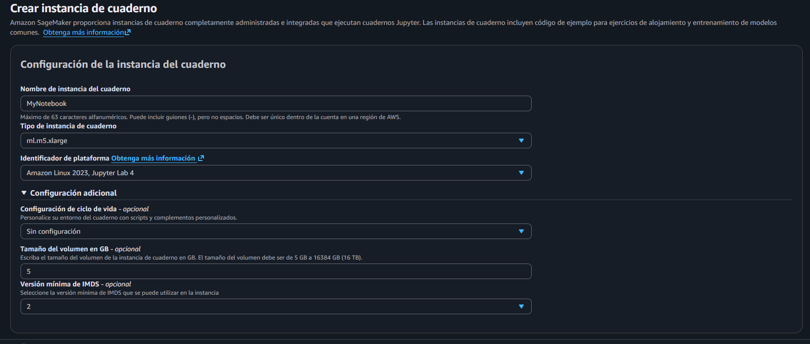
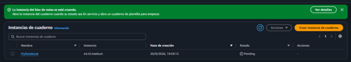
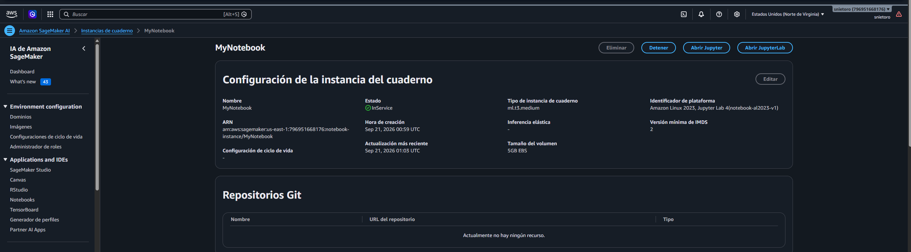
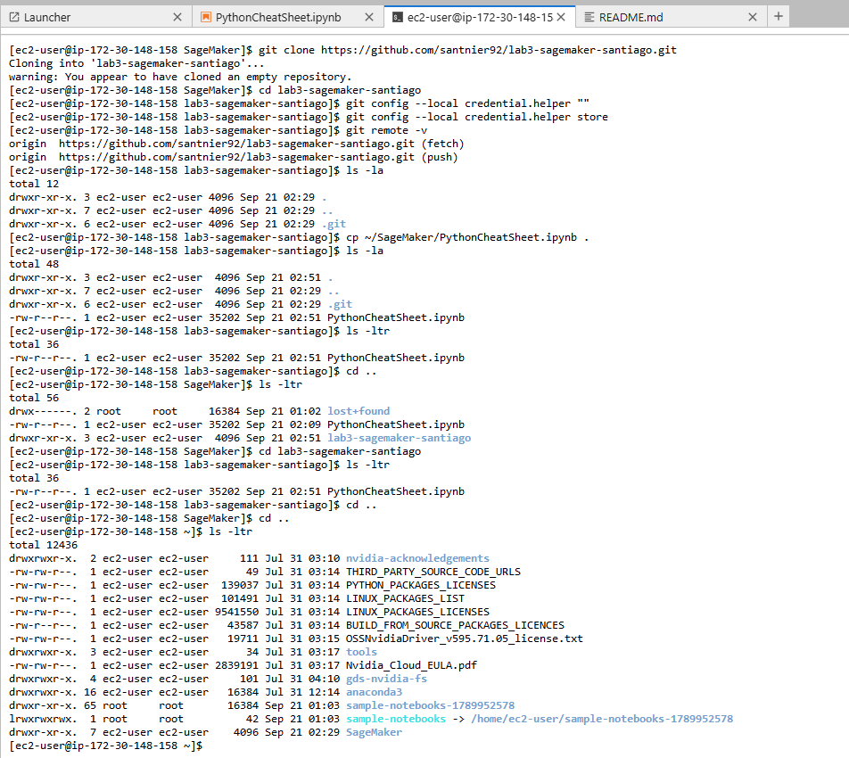
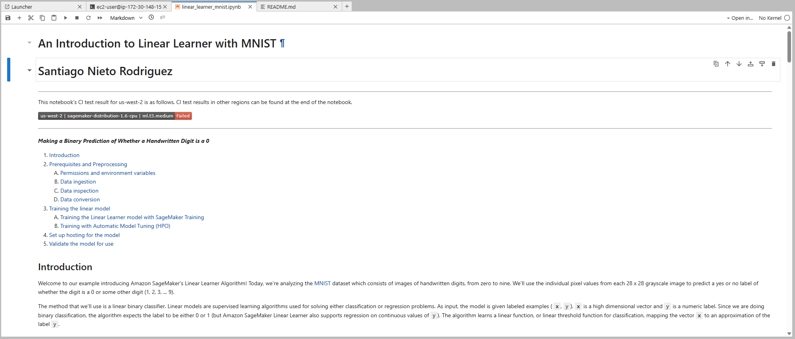
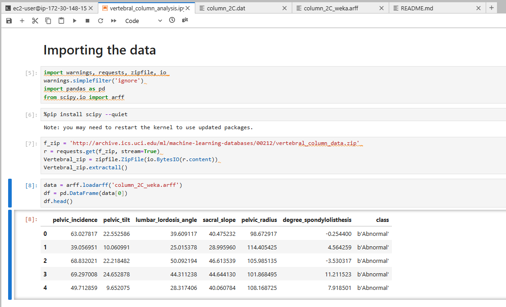
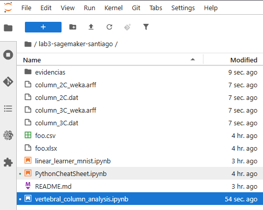
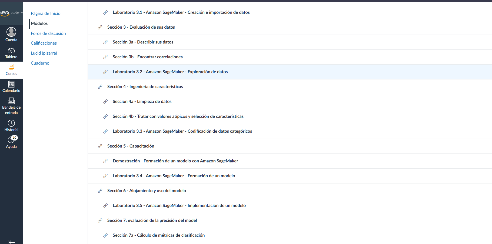
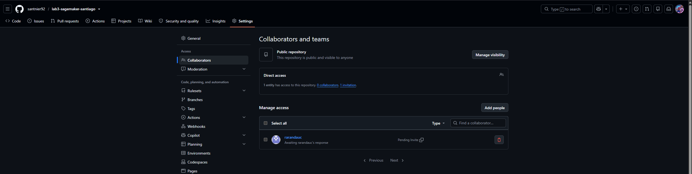

# Laboratorio 3.1 - Amazon SageMaker (Creación e importación de datos)

**Autor:** Santiago Nieto Rodriguez

## Tarea 1 - Creación de un cuaderno de Jupyter con Amazon SageMaker

**Qué hice:** Creé la instancia de cuaderno `MyNotebook` en Amazon SageMaker AI, tipo `ml.m4.xlarge`, con la configuración de ciclo de vida `ml-pipeline`, y esperé a que pasara al estado `InService`.

**Por qué:** Es el entorno base donde se ejecutan los notebooks de las siguientes tareas del laboratorio.

**Evidencia:**

## Tarea 2 - Introducción a JupyterLab

**Qué hice:** Exploré la interfaz de JupyterLab (barra de menú, kernel, tipos de celda) y ejecuté por completo el notebook de ejemplo `PythonCheatSheet.ipynb`.

**Por qué:** Familiarizarme con el entorno de trabajo antes de manipular datos reales en los laboratorios 3.2 y 3.3.

**Evidencia:**

## Tarea 3 - Apertura de un cuaderno de muestra

**Qué hice:** Localicé el notebook de muestra `linear_learner_mnist.ipynb` (algoritmo Linear Learner sobre el dataset MNIST), generé una copia editable fuera de la carpeta de solo lectura, agregué mi nombre en una celda de Markdown al inicio, y recorrí su contenido sin ejecutar las celdas de código (requieren un bucket de Amazon S3, según indica el enunciado).

**Por qué:** Familiarizarme con la estructura de un notebook de entrenamiento de modelos de Amazon SageMaker antes de trabajar con datos propios.

**Evidencia:**

## Tarea 4 - Importación de datos

**Qué hice:** Creé un nuevo cuaderno (`vertebral_column_analysis.ipynb`), instalé la dependencia `scipy` en el kernel `conda_python310`, y agregué código para descargar y extraer el conjunto de datos de la columna vertebral (UCI Machine Learning Repository) en formato `.zip`. Cargué el archivo `column_2C_weka.arff` en un DataFrame de Pandas usando `scipy.io.arff`.

**Por qué:** Es el primer paso para trabajar con datos reales en los laboratorios guiados de exploración y codificación de variables.

**Evidencia:**

## Evidencia adicional

**Acceso a la plataforma del laboratorio:**

**Gestión del repositorio (colaborador invitado):**
